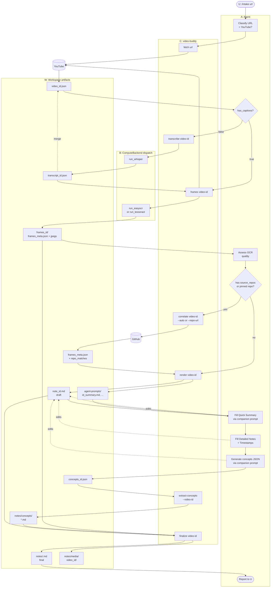

# End-to-end task graph

This document walks the full life of a URL through video-buddy under the agent-driven model. Every task is labeled with its actor; the actor determines what kind of failure is possible and where retries belong.

## Actors

| Symbol | Actor | Owns |
|---|---|---|
| **U** | User | Intent, choice of URL, reading the final note |
| **A** | Agent (Claude Code or equivalent harness) | Every cognitive task: parsing intent, choosing verbs, reading JSON, writing prose, generating concept/summary JSON |
| **C** | video-buddy CLI | Every mechanical task: fetching, transcribing, OCR'ing, cloning, rendering, copying, frontmatter mutation |
| **B** | ComputeBackend (local / ssh / subprocess) | Where GPU-bound work physically runs |
| **W** | Workspace filesystem | The single source of truth for state between tasks |
| **Y** | YouTube (yt-dlp) | External: metadata, captions, audio, video |
| **G** | GitHub (git) | External: repo cloning for correlation |

## Ingest: the full graph



## Task table (ingest)

Read this as the canonical contract. Anything not listed here is out of scope for ingest.

| ID | Actor | Action | Inputs | Outputs / side effects | Depends on | Idempotent? |
|---|---|---|---|---|---|---|
| T1 | U | Invoke `/intake <url>` in agent harness | URL string | Agent context starts | — | n/a |
| T2 | A | Classify URL (video / article / paper / ambiguous) | URL | Routing decision | T1 | yes |
| T3 | A | Invoke `video-buddy fetch <url>` | URL | Subprocess started | T2 | yes |
| T4 | C | Fetch metadata + captions via yt-dlp, extract `source_repos[]` from description | URL, optional `--cookies-from-browser` | Writes `workspace.video_json(id)` | T3 | yes (skips if exists unless `--force`) |
| T5 | A | Read `video_json(id)`, inspect `has_captions` | `video_json(id)` | Branch decision | T4 | yes |
| T6 | A | If `!has_captions`: invoke `video-buddy transcribe <video-id>` | `video_json(id)` | Subprocess started | T5 (branch=false) | yes |
| T7 | C | Download audio (yt-dlp) → `backend.run_whisper(audio, ...)` → merge captions back | `video_json(id)`, optional `--backend`, `--whisper-model` | Writes `workspace.transcript_json(id)`; mutates `video_json(id)` to set `captions[]`, `has_captions=true`, `transcription_source="whisper"` | T6 | yes |
| T8 | A | Invoke `video-buddy frames <video-id>` | `video_json(id)` | Subprocess started | T5 (both branches converge) | yes |
| T9 | C | Download video (yt-dlp) → scenedetect → ffmpeg extract → score + dedup → `backend.run_easyocr` (with Tesseract fallback) | `video_json(id)`, optional `--max-frames`, `--backend`, `--engine` | Writes `workspace.frames_dir(id)/frame_*.jpg` + `frames_meta.json` (with OCR per frame) | T8 | yes (skips capture if frames_meta exists; re-runs OCR only on `--force-ocr`) |
| T10 | A | Read `frames_meta.json`, assess OCR quality and content type | `frames_meta.json` | Context for next decision | T9 | yes |
| T11 | A | If `source_repos[]` non-empty OR agent inferred a repo: invoke `video-buddy correlate <video-id>` | `video_json(id)`, `frames_meta.json`, optional `--repo-url`, `--repo-pool`, `--auto` | Subprocess started | T10 (branch=yes) | yes |
| T12 | C | Clone repos (cached at `workspace.repo_clone_root()`) → index files → fuzzy-match OCR'd identifiers → emit `repo_matches[]` per frame | repos + `frames_meta.json` | Mutates `frames_meta.json` to add `repo_matches[]` per frame | T11 | yes (re-uses repo cache; re-correlation is cheap) |
| T13 | A | Invoke `video-buddy render <video-id>` | `video_json(id)`, `frames_meta.json` | Subprocess started | T10 or T12 | yes |
| T14 | C | Interpolate template + transcript + frame embeds + repo-matched code → write **draft note** with HTML markers → write **companion prompts** | `video_json(id)`, `frames_meta.json`, packaged prompts at `src/video_buddy/prompts/` | Writes `workspace.intermediates/note_<id>.md` (draft) + `workspace.agent_prompt(id, "summary"\|"concepts"\|"detailed-notes"\|"timestamps")` files | T13 | yes (overwrites draft unless `--force-keep` — by design; agent edits happen after render) |
| T15 | A | Read draft + summary companion prompt + transcript → generate Quick Summary → **edit draft in place**, replacing `<!-- agent: fill Quick Summary -->` marker | draft note, `agent_prompt(id, "summary")` | Mutated draft note | T14 | yes (re-running overwrites the section; ok by design) |
| T16 | A | Same pattern for `## Detailed Notes` + `## Timestamps` | draft note, `agent_prompt(id, "detailed-notes")`, `agent_prompt(id, "timestamps")` | Mutated draft note | T15 | yes |
| T17 | A | Generate concept extraction → **write JSON to `workspace.concepts_json(id)`** + replace `<!-- agent: fill Key Concepts -->` marker in draft | draft note, `agent_prompt(id, "concepts")`, list of existing concepts from `workspace.notes/concepts/` | Writes `workspace.concepts_json(id)`; mutated draft note | T16 | yes |
| T18 | A | Invoke `video-buddy extract-concepts --video-id <id>` | `workspace.concepts_json(id)` | Subprocess started | T17 | yes |
| T19 | C | Read concepts JSON → fuzzy-match against existing concept notes → create new concept notes; append source backlinks to existing ones | `concepts_json(id)`, existing `workspace.notes/concepts/*.md` | Writes/updates `workspace.notes/concepts/<slug>.md` files; writes `workspace.concept_result_json(id)` summarising what was created/updated/matched | T18 | yes (existing notes get backlink-appended only if not already present) |
| T20 | A | Invoke `video-buddy finalize <video-id>` | draft note, `concept_result_json(id)`, `frames_meta.json` | Subprocess started | T19 | yes |
| T21 | C | Apply concept-extracted tags to draft frontmatter → merge selected frames into `video_json` → copy selected frame jpegs to `workspace.media_for(id)` → move draft to `workspace.note(slug, month=...)` → emit final note path on stdout | draft note + assorted JSON | Writes `workspace.note(slug, month=...)` (final); writes `workspace.media_for(id)/*.jpg`; removes draft on success | T20 | yes (no-op if final note exists and content hash matches; clobber on `--force`) |
| T22 | A | Report final note path + concept stats + frame stats to U | stdout of T21 | Chat response | T21 | n/a |

## Digest: the abbreviated graph

Digest is a batched ingest, but the agent fills *summaries* (Markdown files at `workspace.summary(id)`) instead of editing per-video draft notes, and the final artifact is one grouped report instead of N notes.

| ID | Actor | Action | Outputs |
|---|---|---|---|
| D1 | U | Invoke `/digest <urls.txt>` | — |
| D2 | A | Invoke `video-buddy digest fetch <urls.txt>` | — |
| D3 | C | Loop over URLs, call same machinery as T4 for each | `video_json(id)` for each (skipping existing); `workspace.manifest(timestamp).json` |
| D4 | A | Read manifest, decide if Whisper batch needed | branch |
| D5 | A | If captionless videos exist: invoke `video-buddy digest transcribe <manifest>` | — |
| D6 | C | Same as T7 but in a loop, Whisper model loaded once | mutated `video_json(id)` for each |
| D7 | A | For each video: read `video_json(id)`, generate per-video summary markdown matching the digest schema | `workspace.summary(id) = intermediates/summaries/video_<id>.md` |
| D8 | A | Invoke `video-buddy digest compile <manifest> --date <YYYY-MM-DD>` | — |
| D9 | C | Read manifest + all summary files → group by channel → emit final digest | `workspace.digest(date) = notes/digests/digest-<date>.md` |
| D10 | A | Present digest path + inline quick-reference table to U | — |

Notable: there is **no** rendered draft per video in digest mode. Digest is a triage tool — it stops short of full ingest. Users follow up by running `/intake <url>` on the videos they decide are worth full processing.

## Contract surface (recap)

The three surfaces between A and C, exhaustively:

1. **CLI verbs.** `fetch`, `transcribe`, `frames`, `correlate`, `render`, `extract-concepts`, `finalize`, `digest fetch`, `digest transcribe`, `digest compile`, `audit`, `init`, `backends`. Every verb is idempotent. Every verb is documented. Every verb accepts `--workspace`, `--backend`, `--config`, `--verbose`. Every verb supports `--json` for machine-readable output.

2. **Conventional file paths.** All resolved through `Workspace` methods:
   - `workspace.video_json(id)` ↔ both write
   - `workspace.transcript_json(id)` ↔ C writes
   - `workspace.frames_dir(id) / "frames_meta.json"` ↔ C writes
   - `workspace.intermediates / "note_<id>.md"` (draft) ↔ both write
   - `workspace.agent_prompt(id, kind)` ↔ C writes, A reads
   - `workspace.concepts_json(id)` ↔ A writes, C reads
   - `workspace.concept_result_json(id)` ↔ C writes, A reads
   - `workspace.summary(id)` (digest mode) ↔ A writes, C reads
   - `workspace.notes / <slug>.md` (final) ↔ C writes
   - `workspace.notes / "concepts" / <slug>.md` ↔ C writes, A reads (for fuzzy-match input)
   - `workspace.media_for(id) / *.jpg` ↔ C writes
   - `workspace.digest(date)` ↔ C writes

3. **In-note markers.** HTML comments the agent locates and replaces. The canonical set, emitted by `render`:
   - `<!-- agent: fill Quick Summary (2-3 sentences from transcript) -->`
   - `<!-- agent: fill Key Concepts (3-10 wiki-linked or plain-listed concepts) -->`
   - `<!-- agent: fill Detailed Notes (sectioned, timestamped from transcript) -->`
   - `<!-- agent: fill Timestamps (MM:SS - description for key moments) -->`

Anything outside these three surfaces is private to one actor. The agent never reads `workspace.cache/`; the CLI never invokes an LLM.

## Idempotency & resumability

Every C task is idempotent on its outputs. The default behavior on re-run:

| Task | Re-run behavior |
|---|---|
| `fetch` | skip if `video_json(id)` exists; `--force` to refetch |
| `transcribe` | skip if `video_json(id)` has `has_captions=true` AND `transcription_source` set; `--force` to retranscribe |
| `frames` | skip frame extraction if `frames_meta.json` exists with non-empty `frames[]`; re-run OCR only on `--force-ocr` |
| `correlate` | always re-correlates (cheap, uses cached clones); cached clones reused unless `--force-clone` |
| `render` | always regenerates draft; companion prompts always regenerated |
| `extract-concepts` | creates new notes; updates existing only by appending missing backlinks |
| `finalize` | no-op if final note hash matches; `--force` to clobber |

A failed run at any step is resumed by simply re-invoking from the failed task — earlier work is preserved.

## Failure modes the agent must handle

| Failure | Where | Recovery |
|---|---|---|
| `fetch` errors (private video, geo-block, age-gate without cookies) | T4 | Agent surfaces error to user; suggests `--cookies-from-browser <browser>`. Pipeline stops. |
| Whisper fails (model download, CUDA OOM) | T7 | Agent retries with `--backend local --device cpu` or falls back to next backend. |
| OCR returns garbage on all frames | T9 | Agent notes low quality, may still proceed; `render` emits Visual Notes anyway. Correlation may be useless. |
| Correlation produces zero matches | T12 | Expected for many videos. Not a failure. Source Code section in note is empty. |
| Repo clone fails (404, auth) | T12 | Agent surfaces, optionally falls back to manual `--repo-url`. Pipeline continues without source code section. |
| Agent's concepts JSON is malformed | T17→T19 | `extract-concepts` validates JSON schema, fails fast with line/column. Agent regenerates. |
| Final note path already exists | T21 | Default refuses to overwrite (informs agent); `--force` clobbers. |

Failures inside C: stderr + non-zero exit + (when `--json`) a structured error to stdout. Failures inside A: agent's responsibility to surface to user.

## Subagent boundaries

Context cost in the primary agent is dominated by transcript-shaped reads at T15-T17 and at D7. For single `/intake` this is manageable (~250-300KB into context). For `/digest` over 50 videos or `/batch-intake` over a channel, the primary agent's context blows up if it does cognitive work itself. The recipes shipped under `examples/claude-code/` spawn subagents for the cognitive-heavy clusters so the primary agent's context stays lean.

### Subagent classes (four)

| Class | Spawned by | Covers | Inputs (paths only) | Outputs (paths only) | Reports |
|---|---|---|---|---|---|
| **CognitiveFill** | `/intake` | T15-T17 as a single unit | draft note, `agent_prompt(id, *)`, `video_json(id)`, `notes/concepts/` (names only) | edits to draft, `concepts_json(id)` | "filled, N concepts produced" |
| **DigestSummary** | `/digest` | D7 batched per ~8 videos | `video_json(id)` × batch, `agent_prompt(id, summary)` × batch | `summary(id)` × batch | "wrote N summaries, K failed" |
| **BatchIngestFill** | `/batch-intake` | full T15-T17 per video × ~5 videos | same as CognitiveFill × N | same as CognitiveFill × N | "filled N drafts, K failed" |
| **CorrelationReview** *(optional)* | `/batch-intake` with `--repo-pool` | post-T12 noise filtering | `frames_meta.json` + pool repo list | edits to `frames_meta.json` zeroing noise matches | "kept M of N matches" |

### Why this works

Three properties of the architecture make subagent spawning cheap:

1. **Workspace conventional paths.** A subagent only needs `(video_id, workspace_root)` to find every artifact it needs. No state inheritance from the primary.
2. **HTML markers as work targets.** A CognitiveFill subagent finds work by grepping for `<!-- agent: fill` in the draft. It is done when no markers remain. Resumable from any crash.
3. **Mechanical verbs stay in primary.** Subagents do not invoke `extract-concepts` or `finalize`. They only edit files in conventional paths. The primary invokes the CLI to commit the work.

### Updated ingest trace with subagent spawn points

Single `/intake`:

```
T1-T14    [A: primary]    fetch, transcribe, frames, correlate, render
T15-T17   [A: subagent]   CognitiveFill — sole responsibility for cognitive work
              ↑           reads transcript + prompts + concept names
              ↓           writes draft edits + concepts_<id>.json
T18-T21   [A: primary]    extract-concepts, finalize
T22       [A: primary]    report to user
```

Batch `/digest` over N videos:

```
D1-D6     [A: primary]    digest fetch, digest transcribe
D7        [A: subagents]  DigestSummary, parallel batches of ~8 videos
              ↑           each subagent: reads K video_jsons + transcripts
              ↓           each subagent: writes K summary files
D8-D10    [A: primary]    digest compile, report
```

Batch `/batch-intake` over N videos in a channel manifest:

```
per-video:  primary runs T1-T14
T15-T17:    [A: subagents] BatchIngestFill, parallel batches of ~5 videos
per-video:  primary runs T18-T22 after each batch reports done
```

### Failure modes specific to subagents

| Failure | Recovery |
|---|---|
| Subagent dies mid-edit | Re-spawn with same inputs; subagent finds remaining HTML markers and continues. Idempotent. |
| Subagent produces malformed concepts JSON | `extract-concepts` schema-validates and fails. Primary re-spawns CognitiveFill with the validation error in context. |
| Wave of subagents all fail with same root cause (e.g. shared backend CUDA OOM) | Primary detects pattern, surfaces diagnostic suggestion to user (`--backend local --device cpu`, retry). |
| One video's transcript is so long (e.g. 4-hour stream) that even the subagent context bloats | Recipe imposes per-chapter cap: split transcript by chapter boundaries from `video_<id>.json`'s metadata, fill per chapter, merge. Edge case; documented but not gated by code in v1. |

### What subagents do NOT do

- **Invoke CLI verbs that mutate vault state.** `extract-concepts` and `finalize` are primary-only. This keeps the wave-dispatch model clean: subagents produce drafts; primary commits.
- **Read each other's outputs.** Subagent batches are independent. If videos A and B genuinely share a concept, the fuzzy-match logic inside `extract-concepts` handles deduplication when both concept JSONs are processed sequentially.
- **Talk to the user.** Only the primary reports. Subagents report to primary; primary aggregates and reports to user.
